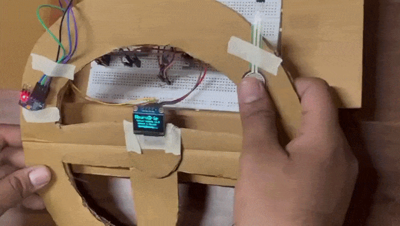

# NeuroGrip

A driver fatigue and stress detection system built using steering wheel grip signals.

The idea is simple: instead of waiting for visible signs like eye closure or lane drift, this system looks at how a driver holds the steering wheel and tries to detect early changes in behavior.

---

## What it does

NeuroGrip monitors three signals from the steering wheel:

- Grip pressure (FSR sensor)
- Skin conductance proxy (using a variable resistor)
- Micro tremors in hand movement

These signals are processed in real time and used to estimate whether the driver is:

- Relaxed  
- Stressed  
- Fatigued  
- In an abnormal state  

The goal is to detect these conditions before they become visibly dangerous.

---
## Authors
**Hardik Teotia** (23BCB0052) · **Janavi Pawar** (23BCB0041)  
VIT Vellore — Embedded Systems, 2026
## Demo

  

